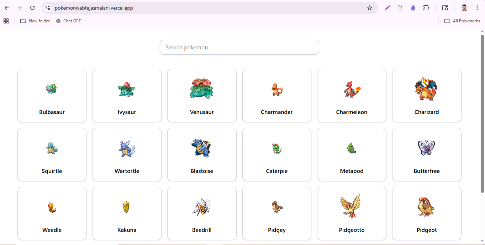
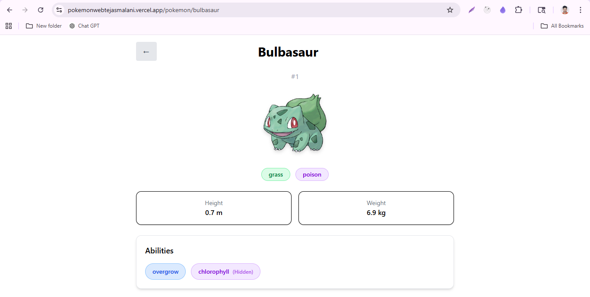

# 🚀 Incubyte Frontend Engineering Kata

A production-ready React application built using **Test-Driven Development (TDD)** to showcase Pokémon listing, filtering, and detail views powered by PokeAPI.

---

## 🌐 Live Demo

👉 https://pokemonwebtejasmalani.vercel.app/

---

## 📸 Screenshots

> *(Add screenshots here if available — listing page, filtering, detail page)*
detail page

Listing page


---

## 🧠 Overview

This application demonstrates a scalable frontend architecture using **React + TypeScript**, focusing on:

* Clean separation of concerns
* Test-driven development (TDD)
* Real-world data fetching patterns
* Performance considerations (debounce)

---

## ✨ Features

### 📋 Pokémon Listing

* Fetches Pokémon data from PokeAPI
* Displays in a clean list/grid
* Handles loading and error states

### 🔍 Search & Filtering

* Real-time filtering by Pokémon name
* Debounced input for performance optimization

### 📄 Pokémon Detail Page

* Click on a Pokémon to view details
* Displays height, weight, and name
* Handles loading and error states

### ⚠️ Error Handling

* Graceful UI for API failures

---

## 🧪 Testing Strategy (TDD)

This project strictly follows **Test-Driven Development**:

1. Write failing tests ❌
2. Implement minimal code ✅
3. Refactor ♻️

### ✅ What is Covered

* Listing page (loading, success, error)
* Filtering logic
* Debounce behavior
* Pokémon detail page
* Basic navigation

### 🎯 Testing Philosophy

Focus is on:

* **User behavior**
* **Business logic**
* **Deterministic tests**

Avoided:

* Over-testing implementation details
* Unnecessary snapshot tests

---

## 🏗️ Architecture

### 📁 Folder Structure

```
src/
  components/
  features/
    pokemon/
  hooks/
  services/
  routes/
```

### 🔑 Key Decisions

* **Feature-based structure** → scalable and maintainable
* **React Query** → efficient data fetching & caching
* **Custom hooks** → separation of logic from UI
* **Debounce hook** → performance optimization

---

## ⚖️ Trade-offs & Decisions

| Decision                          | Reason                              |
| --------------------------------- | ----------------------------------- |
| Used React Query instead of Redux | Simpler, optimized for server state |
| Skipped pagination                | Focused on core functionality       |
| Minimal UI styling                | Prioritized architecture & TDD      |
| Debounce added                    | Improves performance for filtering  |

---

## 🤖 AI Usage

AI tools (ChatGPT) were used intentionally to:

* Scaffold initial test cases
* Assist in setting up testing environment
* Refine debounce testing strategy
* Improve README structure

All generated outputs were:

* Reviewed
* Refined
* Adapted to project requirements

---

## 🛠 Tech Stack

* React (Vite + TypeScript)
* React Router
* React Query (TanStack Query)
* Vitest + React Testing Library
* Tailwind CSS (lightweight styling)

---

## ⚙️ Setup Instructions

### 1. Clone Repository

```bash
git clone https://github.com/TejasMalani/incubyte-pokemon-tdd.git
cd incubyte-pokemon-tdd
```

### 2. Install Dependencies

```bash
npm install
```

### 3. Run Application

```bash
npm run dev
```

### 4. Run Tests

```bash
npm test
```

---

## 🚀 Deployment

The application is deployed using **Vercel**.

* Automatic deployment on every push
* Optimized build using Vite
* Fast global CDN delivery

---

## 📈 What This Demonstrates

* Strong understanding of **TDD workflow**
* Ability to design **scalable frontend architecture**
* Practical use of **modern React ecosystem**
* Focus on **performance and maintainability**

---

## 🙌 Final Note

This project is intentionally designed to reflect **real-world engineering practices**, balancing:

> Simplicity + Scalability + Testability

---

## 📬 Contact

**Tejas Malani**
Frontend Engineer (9+ years)

---
